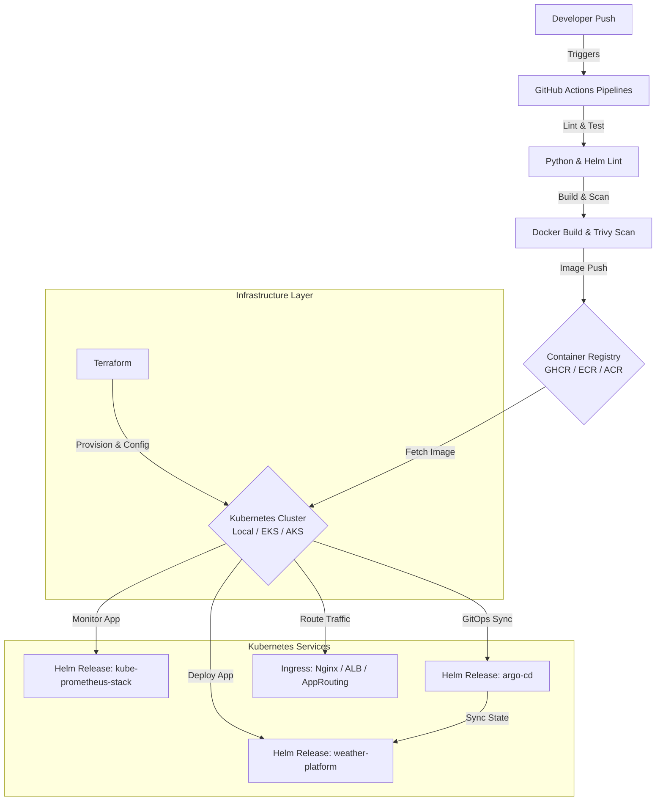

# Weather Platform - Enterprise DevOps & Infrastructure Guide

Welcome to the production-grade Weather Platform repository. This guide provides comprehensive details about the architecture, folder structure, deployment methods, and management workflows for our multi-environment Kubernetes platforms (Local Kubeadm, AWS EKS, and Azure AKS).

---

## 🏗️ Project Architecture

The Weather Platform application is a FastAPI-based weather service containerized using a Dockerfile. The application is deployed onto Kubernetes clusters across three environments: Local, AWS, and Azure. 

The infrastructure and Kubernetes resources are managed via a unified, modular Terraform configuration, integrated with Helm and GitOps (ArgoCD).

### Architectural Workflow



---

## 📁 Folder Structure

We adhere to standard enterprise layout structures for Infrastructure as Code (IaC), Kubernetes charts, bootstrap scripts, and CI/CD.

```
weather-platform/
├── .github/
│   └── workflows/
│       ├── infra.yml          # Terraform pipeline for cloud resources
│       ├── application.yml    # Linting, testing, scanning, docker build, & helm deployment
│       ├── rollback.yml       # Manual revision rollbacks via Helm
│       └── destroy.yml        # Manual cloud resource destruction
├── app/                       # FastAPI Application source code (unmodified)
├── helm/
│   └── weather-platform/      # Parameterized Helm Chart
│       ├── Chart.yaml         # Chart metadata
│       ├── values.yaml        # Global defaults
│       ├── values-local.yaml  # Local environment values
│       ├── values-aws.yaml    # AWS-specific values (ALB)
│       ├── values-azure.yaml  # Azure-specific values (App Routing)
│       └── templates/         # Kubernetes templates (deployment, service, ingress, HPA, secret, etc.)
├── scripts/
│   └── bootstrap/             # Node & cluster bootstrap scripts
│       ├── 01-install-prerequisites.sh
│       ├── 02-install-helm.sh
│       ├── 03-install-ingress.sh
│       ├── 04-install-monitoring.sh
│       ├── 05-install-argocd.sh
│       ├── 06-install-storage.sh
│       └── 07-verify.sh
└── terraform/
    ├── modules/               # Reusable modules
    │   ├── aws/               # VPC, IAM, EKS, ECR, CloudWatch
    │   ├── azure/             # Resource Group, VNet, AKS, ACR, Azure Monitor
    │   └── kubernetes/        # Namespaces, RBAC, Ingress, StorageClass, Helm Releases (App, Prometheus, ArgoCD)
    ├── aws/                   # AWS EKS runner config
    ├── azure/                 # Azure AKS runner config
    └── local/                 # Local Kubernetes runner config
```

---

## 🚀 Local Deployment (kubeadm Cluster)

For local development, we assume a Kubernetes cluster is already running (e.g. standard kubeadm node).

### 1. Bootstrap Local Environment
Run the bootstrap scripts sequentially to install dependencies and deploy core services:
```bash
# Set up Docker, Kubectl, Terraform, and system packages
sudo ./scripts/bootstrap/01-install-prerequisites.sh

# Install Helm CLI
./scripts/bootstrap/02-install-helm.sh

# Configure Dynamic Storage Class
./scripts/bootstrap/06-install-storage.sh

# Install Nginx Ingress Controller
./scripts/bootstrap/03-install-ingress.sh

# Install Prometheus/Grafana Monitoring Stack
./scripts/bootstrap/04-install-monitoring.sh

# Install ArgoCD GitOps engine
./scripts/bootstrap/05-install-argocd.sh

# Verify health of cluster components
./scripts/bootstrap/07-verify.sh
```

### 2. Deploy Application via Terraform Local Runner
Apply the local Kubernetes manifests and release the Helm chart:
```bash
cd terraform/local
terraform init
terraform plan -out=tfplan
terraform apply tfplan
```

### 3. Verification & Access
Verify that the app is accessible at `http://weather.local/` (ensure `weather.local` points to your cluster IP in `/etc/hosts` or `C:\Windows\System32\drivers\etc\hosts`).

---

## ☁️ AWS Deployment (EKS)

### 1. Prerequisites
Ensure you have the AWS CLI configured with administrator permissions:
```bash
aws configure
```

### 2. Infrastructure Deployment
Use Terraform to deploy the AWS EKS cluster, ECR registry, CloudWatch logs, and Kubernetes resources:
```bash
cd terraform/aws
terraform init \
  -backend-config="bucket=your-custom-s3-bucket" \
  -backend-config="key=weather-platform/terraform.tfstate" \
  -backend-config="region=us-east-1"

terraform plan -var="groq_api_key=your_api_key_here" -out=tfplan
terraform apply tfplan
```

This provisions:
* **VPC**: 2 Public and 2 Private subnets across multiple AZs, with internet/NAT Gateways.
* **EKS**: Managed Kubernetes cluster running node groups.
* **ECR**: Docker registry for storing the app container images.
* **ALB**: Deploys AWS Load Balancer Controller to manage traffic routing.
* **CloudWatch**: Logs application stdout and EKS control plane metrics.
* **Kubernetes Resources**: Namespaces, StorageClass, RBAC, Helm releases (App, Prometheus, ArgoCD).

---

## 🔷 Azure Deployment (AKS)

### 1. Prerequisites
Log in to your Azure account:
```bash
az login
```

### 2. Infrastructure Deployment
Deploy resources to AKS:
```bash
cd terraform/azure
terraform init \
  -backend-config="resource_group_name=your-resource-group" \
  -backend-config="storage_account_name=yourstorageaccount" \
  -backend-config="container_name=terraform-state" \
  -backend-config="key=weather-platform/terraform.tfstate"

terraform plan -var="groq_api_key=your_api_key_here" -out=tfplan
terraform apply tfplan
```

This provisions:
* **Resource Group**: Unified grouping for AKS infrastructure.
* **VNet**: Isolated network subnetted for AKS nodes.
* **AKS**: Azure Kubernetes Service running node auto-scalers.
* **ACR**: Azure Container Registry for image storage.
* **Azure Monitor**: Container Insights integration via Log Analytics Workspace.
* **Kubernetes Resources**: Namespaces, StorageClass, Ingress rules, Helm releases (App, Prometheus, ArgoCD).

---

## 🛠️ Workflows

### Terraform Workflow
All environments (`aws`, `azure`, `local`) invoke the same underlying `modules/kubernetes` to deploy cluster resources. This ensures consistency between your local development machine and your production environments.

### Helm Workflow
The application uses a custom Helm chart located at [helm/weather-platform](file:///d:/Azure-Resource/devops-mastery/weather-platform/helm/weather-platform). Configurable attributes (such as replicas, endpoints, and ingress settings) are mapped to environment values files:
* Local: [values-local.yaml](file:///d:/Azure-Resource/devops-mastery/weather-platform/helm/weather-platform/values-local.yaml)
* AWS: [values-aws.yaml](file:///d:/Azure-Resource/devops-mastery/weather-platform/helm/weather-platform/values-aws.yaml)
* Azure: [values-azure.yaml](file:///d:/Azure-Resource/devops-mastery/weather-platform/helm/weather-platform/values-azure.yaml)

### GitHub Actions Workflow
The CI/CD layout is split into four pipelines to maximize security, modularity, and control:
1. **Infrastructure (`infra.yml`)**: Provisions EKS/AKS resources when Terraform code changes.
2. **Application (`application.yml`)**: Triggered by pushes to the application code, this pipeline runs quality checks, docker builds, security scans, pushes to the registry, and upgrades the Helm release.
3. **Rollback (`rollback.yml`)**: Offers a manual button to roll back deployment failures cleanly.
4. **Destroy (`destroy.yml`)**: Performs a teardown of the cloud infrastructure, requiring confirmation before execution.

```
[Lint & Test] ──> [Docker Build] ──> [Trivy Scan] ──> [Image Push] ──> [Helm Upgrade] ──> [Health Check] ──> [On Failure: Rollback]
```

### Bootstrap Script Flow
The cluster bootstrapping is handled by a sequence of scripts under [scripts/bootstrap](file:///d:/Azure-Resource/devops-mastery/weather-platform/scripts/bootstrap):
* **01-install-prerequisites.sh**: Installs system requirements (Docker, kubectl, Terraform).
* **02-install-helm.sh**: Installs the Helm 3 package manager.
* **03-install-ingress.sh**: Installs ingress controller rules.
* **04-install-monitoring.sh**: Prepares metrics endpoints via Prometheus & Grafana.
* **05-install-argocd.sh**: Deploys ArgoCD.
* **06-install-storage.sh**: Provisions dynamic storage classes.
* **07-verify.sh**: Tests endpoints and checks node/pod states.

### Rollback Process
If a deployment fails, the application pipeline automatically executes a rollback. Manual rollbacks can also be triggered via the `rollback.yml` workflow, or by executing:
```bash
helm rollback weather-platform -n weather
```

### Destroy Process
To delete resources and clean up, run:
```bash
# Run GHA destroy workflow, or run manually:
cd terraform/<environment>
terraform destroy -var="groq_api_key=your_api_key_here" -auto-approve
```

---

## 🔄 Migrations

### Local to AWS
1. **Container Build**: Push the local docker image to ECR:
   ```bash
   aws ecr get-login-password --region us-east-1 | docker login --username AWS --password-stdin <ecr_repo_url>
   docker tag weather-platform:latest <ecr_repo_url>:latest
   docker push <ecr_repo_url>:latest
   ```
2. **Terraform Apply**: Run the AWS runner to spin up VPC, EKS, and ECR.
3. **ArgoCD Sync**: Connect ArgoCD to target EKS, and apply the AWS-specific values.

### AWS to Azure
1. **Acquire Credentials**: Log in to Azure and authenticate ACR:
   ```bash
   az acr login --name <acr_name>
   ```
2. **Transfer Container**: Re-tag and push the ECR image to ACR:
   ```bash
   docker pull <ecr_repo_url>:latest
   docker tag <ecr_repo_url>:latest <acr_login_server>/weather-platform:latest
   docker push <acr_login_server>/weather-platform:latest
   ```
3. **Execute Runner**: Run the Azure Terraform config.
4. **Deploy Webapp-routing**: Deploy ingress controller on AKS.

---

## 🛡️ Disaster Recovery (DR)

### Backup Strategy
* **State Backups**: Terraform states are stored in S3/Blob Storage with versioning enabled and DynamoDB state locking.
* **Config backups**: Store ArgoCD declarations and Helm values files in Git.

### Recovery Flow
1. In the event of a cluster failure, execute the `infra.yml` GitHub Actions pipeline (or execute `terraform apply` locally) to provision a replica environment.
2. Run the bootstrap verify scripts to ensure namespaces are active.
3. Apply the ArgoCD definitions to sync the application configurations.
4. If recovery fails, execute the rollback script to return to the last known stable configuration.

---

## 🎖️ Best Practices
* **Least Privilege**: EKS/AKS roles are constrained to system-required permissions.
* **Securing Secrets**: API keys are isolated in Kubernetes Secrets and injected dynamically.
* **Resource Limits**: Configured CPU/Memory boundaries prevent memory leaks and noisy-neighbor issues.
* **Immutable Tags**: Pipelines tag docker images with the Git commit SHA, avoiding reliance on `latest` in production.

---

## 📝 CHANGELOG

Below is the list of modifications made to align the Weather Platform repository with enterprise DevOps standards:

| File | Change Type | Reason for Modification |
|---|---|---|
| [Chart.yaml](file:///d:/Azure-Resource/devops-mastery/weather-platform/helm/weather-platform/Chart.yaml) | **[NEW]** | Replaced raw YAML manifests with a modular Helm chart structure. |
| [values.yaml](file:///d:/Azure-Resource/devops-mastery/weather-platform/helm/weather-platform/values.yaml) | **[NEW]** | Default properties definition for replicas, images, and probes. |
| [values-local.yaml](file:///d:/Azure-Resource/devops-mastery/weather-platform/helm/weather-platform/values-local.yaml) | **[NEW]** | Local Ingress configurations and deployment parameters. |
| [values-aws.yaml](file:///d:/Azure-Resource/devops-mastery/weather-platform/helm/weather-platform/values-aws.yaml) | **[NEW]** | AWS-specific annotations for the ALB controller. |
| [values-azure.yaml](file:///d:/Azure-Resource/devops-mastery/weather-platform/helm/weather-platform/values-azure.yaml) | **[NEW]** | Azure-specific ingress settings for AKS app routing. |
| [_helpers.tpl](file:///d:/Azure-Resource/devops-mastery/weather-platform/helm/weather-platform/templates/_helpers.tpl) | **[NEW]** | Helm helper functions for namespacing and resource naming labels. |
| [deployment.yaml](file:///d:/Azure-Resource/devops-mastery/weather-platform/helm/weather-platform/templates/deployment.yaml) | **[NEW]** | Dynamically-parameterized deployment template with health checks and probes. |
| [service.yaml](file:///d:/Azure-Resource/devops-mastery/weather-platform/helm/weather-platform/templates/service.yaml) | **[NEW]** | Helm-templated ClusterIP service for the Weather application. |
| [ingress.yaml](file:///d:/Azure-Resource/devops-mastery/weather-platform/helm/weather-platform/templates/ingress.yaml) | **[NEW]** | Ingress rule templates matching different target environment Ingress classes. |
| [hpa.yaml](file:///d:/Azure-Resource/devops-mastery/weather-platform/helm/weather-platform/templates/hpa.yaml) | **[NEW]** | Horizontal Pod Autoscaler configuration supporting replica scaling. |
| [secrets.yaml](file:///d:/Azure-Resource/devops-mastery/weather-platform/helm/weather-platform/templates/secrets.yaml) | **[NEW]** | Templated Kubernetes secret to secure the Groq API key injection. |
| [servicemonitor.yaml](file:///d:/Azure-Resource/devops-mastery/weather-platform/helm/weather-platform/templates/servicemonitor.yaml) | **[NEW]** | Standard Prometheus Operator metric scraping configuration. |
| [variables.tf](file:///d:/Azure-Resource/devops-mastery/weather-platform/terraform/modules/aws/variables.tf) | **[NEW]** | Input variables definition for AWS infrastructure module. |
| [main.tf](file:///d:/Azure-Resource/devops-mastery/weather-platform/terraform/modules/aws/main.tf) | **[NEW]** | AWS VPC, Subnet, EKS, IAM, ECR, and CloudWatch resource definitions. |
| [outputs.tf](file:///d:/Azure-Resource/devops-mastery/weather-platform/terraform/modules/aws/outputs.tf) | **[NEW]** | Exposes EKS endpoints and ECR URLs for configuration runners. |
| [variables.tf](file:///d:/Azure-Resource/devops-mastery/weather-platform/terraform/modules/azure/variables.tf) | **[NEW]** | Input variables definition for Azure infrastructure module. |
| [main.tf](file:///d:/Azure-Resource/devops-mastery/weather-platform/terraform/modules/azure/main.tf) | **[NEW]** | Azure RG, VNet, Subnet, AKS, ACR, and Log Analytics resource definitions. |
| [outputs.tf](file:///d:/Azure-Resource/devops-mastery/weather-platform/terraform/modules/azure/outputs.tf) | **[NEW]** | Exposes AKS credentials and ACR logins for configuration runners. |
| [variables.tf](file:///d:/Azure-Resource/devops-mastery/weather-platform/terraform/modules/kubernetes/variables.tf) | **[NEW]** | Input variables definition for shared Kubernetes module. |
| [main.tf](file:///d:/Azure-Resource/devops-mastery/weather-platform/terraform/modules/kubernetes/main.tf) | **[NEW]** | Deploys Namespaces, RBAC, StorageClass, Ingress, Monitoring, ArgoCD, and App. |
| [outputs.tf](file:///d:/Azure-Resource/devops-mastery/weather-platform/terraform/modules/kubernetes/outputs.tf) | **[NEW]** | Exposes namespaces and release status metadata. |
| [variables.tf](file:///d:/Azure-Resource/devops-mastery/weather-platform/terraform/local/variables.tf) | **[NEW]** | Input variables for local Kubernetes resources environment. |
| [main.tf](file:///d:/Azure-Resource/devops-mastery/weather-platform/terraform/local/main.tf) | **[NEW]** | Local environment runner configuring local Kube context and shared module. |
| [outputs.tf](file:///d:/Azure-Resource/devops-mastery/weather-platform/terraform/local/outputs.tf) | **[NEW]** | Exposes release status outputs for the local runner. |
| [variables.tf](file:///d:/Azure-Resource/devops-mastery/weather-platform/terraform/aws/variables.tf) | **[MODIFY]** | Overwritten to define inputs for EKS worker nodes and AWS settings. |
| [main.tf](file:///d:/Azure-Resource/devops-mastery/weather-platform/terraform/aws/main.tf) | **[MODIFY]** | Overwritten to link AWS infrastructure with the shared Kubernetes module. |
| [outputs.tf](file:///d:/Azure-Resource/devops-mastery/weather-platform/terraform/aws/outputs.tf) | **[MODIFY]** | Overwritten to aggregate EKS cluster outputs and Helm release details. |
| [variables.tf](file:///d:/Azure-Resource/devops-mastery/weather-platform/terraform/azure/variables.tf) | **[MODIFY]** | Overwritten to define inputs for AKS VMs and Azure resource groups. |
| [main.tf](file:///d:/Azure-Resource/devops-mastery/weather-platform/terraform/azure/main.tf) | **[MODIFY]** | Overwritten to link Azure infrastructure with the shared Kubernetes module. |
| [outputs.tf](file:///d:/Azure-Resource/devops-mastery/weather-platform/terraform/azure/outputs.tf) | **[MODIFY]** | Overwritten to aggregate AKS endpoints and Helm release details. |
| [01-install-prerequisites.sh](file:///d:/Azure-Resource/devops-mastery/weather-platform/scripts/bootstrap/01-install-prerequisites.sh) | **[NEW]** | Installs curl, git, docker, kubectl, and terraform on Linux clusters. |
| [02-install-helm.sh](file:///d:/Azure-Resource/devops-mastery/weather-platform/scripts/bootstrap/02-install-helm.sh) | **[NEW]** | Script to download and install Helm 3 client binary. |
| [03-install-ingress.sh](file:///d:/Azure-Resource/devops-mastery/weather-platform/scripts/bootstrap/03-install-ingress.sh) | **[NEW]** | Bootstraps the Nginx Ingress Controller using Helm releases. |
| [04-install-monitoring.sh](file:///d:/Azure-Resource/devops-mastery/weather-platform/scripts/bootstrap/04-install-monitoring.sh) | **[NEW]** | Installs kube-prometheus-stack for Grafana and Prometheus monitoring. |
| [05-install-argocd.sh](file:///d:/Azure-Resource/devops-mastery/weather-platform/scripts/bootstrap/05-install-argocd.sh) | **[NEW]** | Bootstraps ArgoCD to standard namespaces. |
| [06-install-storage.sh](file:///d:/Azure-Resource/devops-mastery/weather-platform/scripts/bootstrap/06-install-storage.sh) | **[NEW]** | Sets up rancher local-path provisioner storage class for local clusters. |
| [07-verify.sh](file:///d:/Azure-Resource/devops-mastery/weather-platform/scripts/bootstrap/07-verify.sh) | **[NEW]** | Runs sanity tests checking nodes, pods, services, and routing. |
| [infra.yml](file:///d:/Azure-Resource/devops-mastery/weather-platform/.github/workflows/infra.yml) | **[NEW]** | GHA pipeline managing cloud resource provisioning. |
| [application.yml](file:///d:/Azure-Resource/devops-mastery/weather-platform/.github/workflows/application.yml) | **[NEW]** | GHA pipeline handling Python/Helm linting, docker builds, security scans, and upgrades. |
| [rollback.yml](file:///d:/Azure-Resource/devops-mastery/weather-platform/.github/workflows/rollback.yml) | **[NEW]** | GHA pipeline offering manual Helm revision rollback actions. |
| [destroy.yml](file:///d:/Azure-Resource/devops-mastery/weather-platform/.github/workflows/destroy.yml) | **[NEW]** | GHA pipeline offering manual resource teardown. |
| Legacy `k8s/` | **[DELETE]** | Raw manifests directory removed in favor of Helm templates. |
| Legacy `deploy-aws.sh`, `deploy-azure.sh`, `destroy-aws.sh`, `destroy-azure.sh` | **[DELETE]** | ECS and App Service shell scripts replaced by modular workflows. |
| Legacy `devops_bootstrap.py`, `devops_cleanup.py` | **[DELETE]** | Legacy bootstrap files replaced by modular bash scripts. |
| Legacy `ci-cd.yml` | **[DELETE]** | Replaced by split workflow pipelines under `.github/workflows/`. |
| Legacy `terraform/aws/` `.tf` files | **[DELETE]** | Removed ECS Fargate, ALB, and security files, replaced by modules. |
| Legacy `terraform/azure/` `.tf` files | **[DELETE]** | Removed App Service, App Plan, and key vault files, replaced by modules. |
